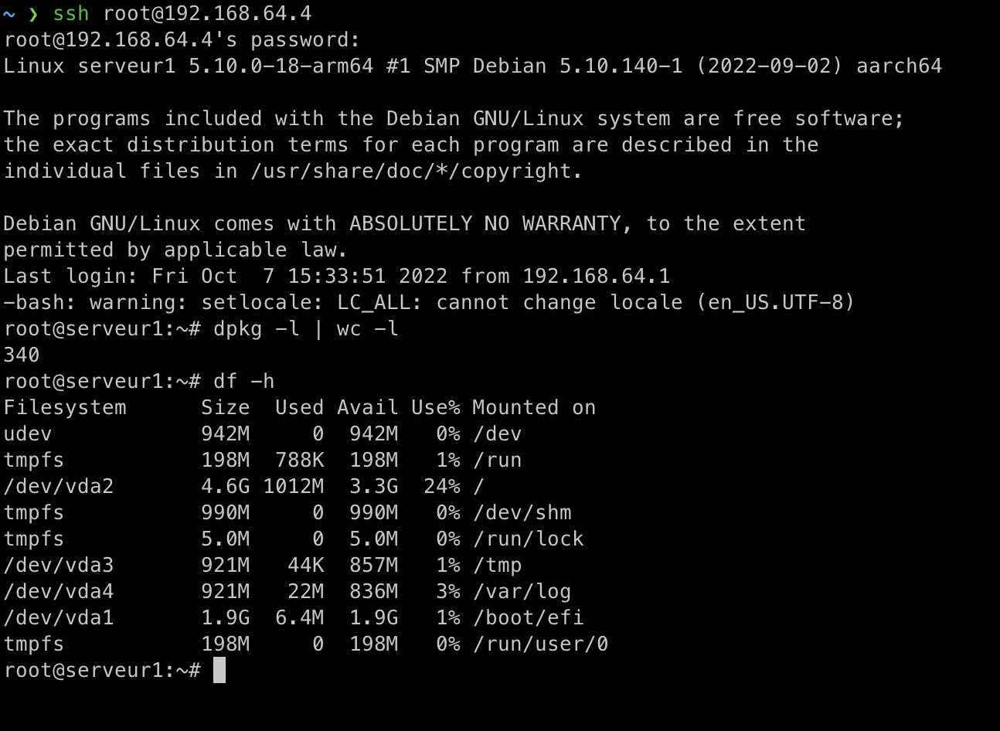
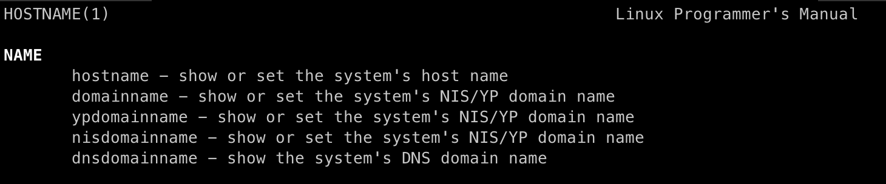
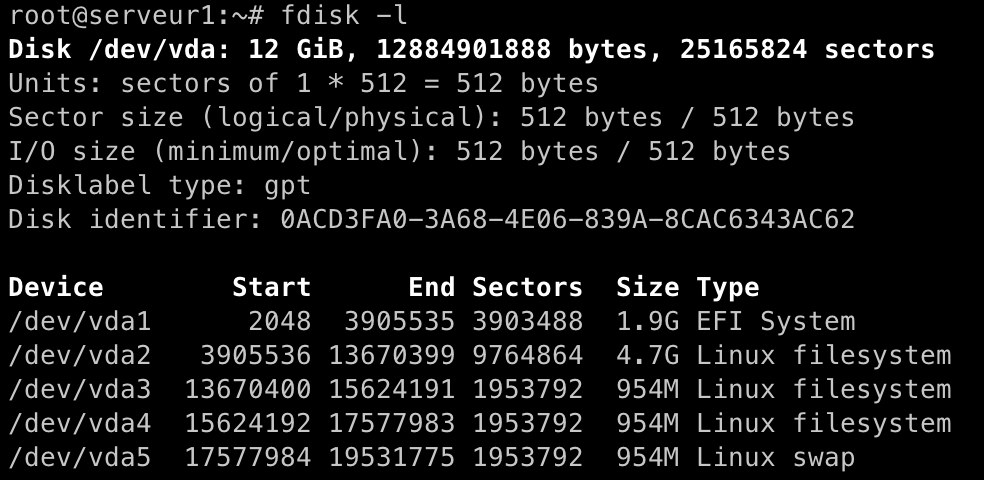
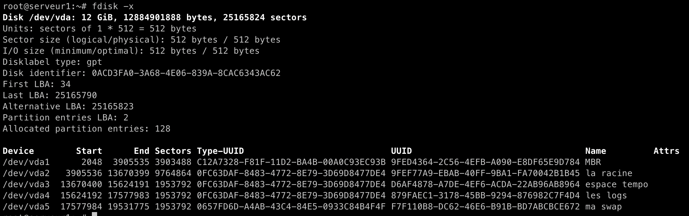

# Système Unix - TP1

## Installation du système d'exploitation

J'ai suivi les instructions du TP, en faisant des ajustements pour faire fonctionner l'installation sur mon ordinateur Apple.

Aucun problème majeur à signaler.

## Configuration de SSH

Le but de cette étape est de **pouvoir me connecter à la ligne de commande de la machine virtuelle**, avec l'utilisateur root, **depuis le terminal de ma machine**.

Pour cela, il a fallu:

- installer ssh
    - `apt install ssh`
- trouver l'adresse IPv4 locale de la machine virtuelle
    - `ip addr`
    - cela a donné `192.168.64.4`
- éditer le fichier de configuration du serveur ssh pour permettre la connexion à l'utilisateur `root`
    - `nano /etc/ssh/sshd_config`
    - dans le fichier, décommenter `PermitRootLogin yes`
- redémarrer le serveur ssh
    - `systemctl restart sshd`
- depuis ma machine, me connecter à la machine virtuelle avec la commande:
    - `ssh root@192.168.64.4`

## Nombre de paquets

En faisant tourner la commande `dpkg -l | wc -l`, j'ai obtenu **340**, au lieu des **320** indiqués dans le sujet de ce TP.

Mon hypothèse est que cela est lié au le fait que ma machine virtuelle est de type ARM, étant donné que mon processeur est de type ARM.

## Space Usage

Le résultat de la commande `df -h` indique que la partition / représente moins de 1GB, comme précisé dans le TP.



## Commandes à expliquer

- `echo $LANG`
    - Affiche la variable d'environnement `$LANG`, qui correspond à la configuration des *locales*.
    - donne comme résultat `fr_FR.UTF-8`
- `hostname`
    - Appelé sans arguments, affiche le nom DNS de la machine hôte
    - donne comme résultat `serveur1`, comme attendu
- `man hostname` nous montre comment afficher le nom de domaine

    - la commande `domainname`, appelée sans arguments, affiche le nom de domaine

- `cat /etc/apt/sources.list | grep -v -E '^#|^$'` 
    - Affiche le contenu du fichier `/etc/apt/sources.list` et le filtre, en ne gardant que les lignes décommentées, grâce à une expression régulière.
    - donne comme résultat
    ```
    deb http://ftp.fr.debian.org/debian/ bullseye main
    deb http://security.debian.org/debian-security bullseye-security main
    deb http://ftp.fr.debian.org/debian/ bullseye-updates main
    ```
- `cat /etc/shadow | grep -vE ':\*:|:!\*:'`
    - Affiche le contenu du fichier `/etc/shadow` et le filtre, en ne gardant que les lignes pour lesquelles la valeur après le premier caractère ':' n'est pas '*', grâce à une expression régulière. Ce sont donc les lignes du fichier pour lesquelles la version encryptée du mot de passe utilisateur est présente.
    - donne comme résultat `root:$y$j9T$inn/f2.CVeeY1Y4VDre2W0$M4PWR7liJQ78Cn/IEIqb.GhbgFxs0AKu2OG.YZ4njT3:19272:0:99999:7:::`, correspondant au compte root

- `cat /etc/passwd | grep -vE 'nologin|sync'`
    - Affiche et filtre le contenu du fichier `/etc/passwd` qui contient la configuration des comptes utilisateurs du système, en ne gardant, grâce à une expression régulière, que les lignes qui ne contiennent pas les caractères 'nologin' et 'sync'. Ce sont donc les comptes utilisateurs ayant accès à un bash
    - donne comme résultat `root:x:0:0:root:/root:/bin/bash`, encore une fois correspondant au compte root, le seul compte utilisateur créé sur cette machine

- `fdisk -l`

    - L'option `-l` de `fdisk` permet de **lister** les partitions du disque 

- `fdisk -x`

    - L'option `-x` de `fdisk` permet de faire la même chose que l'option `-l` mais en affichant plus de détails

- `df -h`
    - Affiche l'espace  de stockage utilisé par les systèmes de fichiers

## Aller plus loin

### Preseed

Sert à programmer à l'avance les réponses aux questions posées durant l'installation du système d'exploitation Debian.

### Rescue mode

Afin de réinitialiser le mot de passe de l'utilisateur `root`,
une des méthodes consiste à:
- démarrer depuis une image système live
- monter le système de fichier racine (`/dev/vda2` dans mon cas) à la racine `/`
- utiliser la commande `passwd` pour changer le mot de passe de l'utilisateur root

