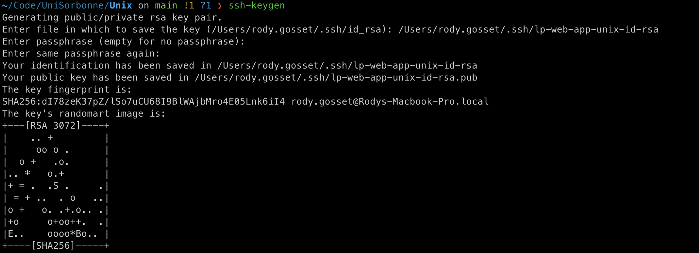
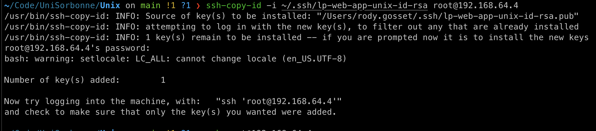
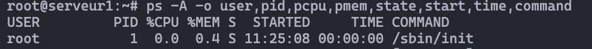
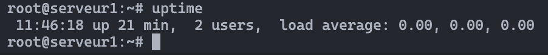

# Services, processus signaux

## Connection ssh root

***Reprise du TP 1***

Le but de cette étape est de **pouvoir me connecter à la ligne de commande de la machine virtuelle**, avec l'utilisateur root, **depuis le terminal de ma machine**.

Pour cela, il a fallu:

- installer ssh
    - `apt install ssh`
- trouver l'adresse IPv4 locale de la machine virtuelle
    - `ip addr`
    - cela a donné `192.168.64.4`
- éditer le fichier de configuration du serveur ssh pour permettre la connexion à l'utilisateur `root`
    - `nano /etc/ssh/sshd_config`
    - dans le fichier, décommenter `PermitRootLogin yes`
- redémarrer le serveur ssh
    - `systemctl restart sshd`
- depuis ma machine, me connecter à la machine virtuelle avec la commande:
    - `ssh root@192.168.64.4`

## Authentification par clef & Génération de clefs

Afin de ne pas avoir à utiliser de mot de passe pour se connecter en SSH à un serveur, on peut utiliser les clés SSH.

Nous en avons réussi à faire cela en suivant ces étapes:

- Créer le fichier `/root/.ssh/authorized_keys` sur le serveur
- Générer une pair de clés SSH depuis la machine hôte

- Ajuster les droits d'accès à la clé pour que seulement le propriétaire puisse y accéder en lecture, écriture et execution
    - `chmod 700 ~/.ssh/id_rsa*`
- Déposer la clé publique sur le serveur


Après cela, il est enfin possible de se connecter en tant que root à notre serveur en utilisant notre clé SSH privée
```
ssh -i ~/.ssh/id_rsa root@192.168.64.4
```


### Sécurisation de l'authentification à SSH

Une *attaque bruteforce* consiste à bombarder un serveur de requêtes d'authentification en essayant différentes combinaisons de mots de passe jusqu'à trouver la bonne.

Afin de se protéger des attaques par bruteforce, il est possible de:
- modifier le port sur lequel tourne le service `sshd`
    - avantages
        - permet d'éviter bcp d'attaques car les attanquant essaient d'entrer par le port par défaut
    - inconvénient
        - laisse toujours le serveur vulnérable aux attaques bruteforce sur le nouveau port 
- limiter le nombre maximum d'essais de connexion échoués venant d'une IP, et bloqurer cette IP si ce nombre est dépassé
    - avantage
        - permet de garder l'authentification par mot de passe
    - inconvénient
        - l'attaquant a la possibilité de changer d'IP afin de continuer son attaque, donc coutourner cette mesure de sécurité
- désactiver l'authentification par mot de passe
    - avantage(s)
        - impossible pour un attanquant de lancer une attaque bruteforce
    - inconvénient
        - demande la générer puis de gérer une pair de clés SSH pour chaque client SSH
    - mise en oeuvre 
        - modification du fichier `/etc/ssh/sshd_config` en décommentant la ligne 
        ```
        #PasswordAuthentication yes
        ```
        et en changeant le `yes` en `no`, ce qui donne
        ```
        PasswordAuthentication no
        ```

## Processus

### Etude des processus UNIX


*Question 1*

La commande utilisée pour afficher les infos demandées est
```
ps -A -o user,pid,pcpu,pmem,state,start,time,command
```

L'information TIME correspon au temps total d'utilisation du CPU par le processus.

Le processus ayant utilisé le plus le processeur est le serveur ssh, `sshd`.


La machine a démarrée à 11:25:08



La commande `uptime` permet de connaître le temps s'étant écoulé depuis le démarrage de la machine.



Il est possible de connaître le nombre de processus crées depuis le démarrage de la machine en utilisant la commande

```
cat /proc/stat | grep processes
```

En effet, le fichier `/proc/stat` a une entrée qui compte cette information.

*Question 2*

Pour afficher le ppid des processus avec la commande ps,
il est possible d'ajouter ce champ aux autres champs affichés par défaut avec la commande

```
ps -O ppid
```

Pour donner la liste ordonnée de tous les processus ancêtres de la commande ps en cours d'exécution, on utilise la commande

```
ps -h 
```

*Question 3*

La commande `pstree` permet d'afficher l'arbre des processus.

L'option `-p` permet d'afficher le pid de chaque processus, et donc de connaître le pid du parents de chaque processus.

L'option `-s [PID]` permet d'afficher la liste ordonnée de tous les processus ancêtres d'un processus en particulier.

*Question 4*

Afin d'afficher la liste de processus triée par occupation mémoire décroissante, il est possible, dans la commande `top` de faire `SHIFT + F` et ensuite de séléctionner `%MEM` avec la touche `s`.

Sur ma machine, le processus le plus gourmand est `systemd`.

Ce service est utilisé pour initialiser le système et gérer les services.

Pour passer l'affiche de `top` en couleur, on utilise la touche `z`.

Afin de mettre en avant la colonne de trie, il est possible d'appuyer sur la touche `x` pour qu'elle soit affichée en gras.
Appuyer sur `SHIFT + F` permet d'accéder au menu permettant de changer la colonne de trie.

La commande `htop` est une version de `top` faites pour être plus claire et simple d'utilisation par défaut que `top`. 
Les couleurs sont utilisées par défaut pour mettre en avant certaines informations,  
les commandes utiles sont indiquées en bas par défaut, etc.  
Seulement, `top` est connu pour avoir beaucoup de paramètres de customization et est installé par défaut sur beaucoup de systèmes, contrairement à `htop` qui nécessite d'être installé.

### Arrêt d'un processus

La commande `jobs` permet de voir les processus dormant.
`fg` amène au premier plan (foreground) le dernier processus endormi.
`CTRL-C` permet d'envoyer un signal d'arrêt au processus en exécution.

`ps` permet de voir les processus chargés en mémoire.
`kill -9 <pid>` permet de tuer un processus.

Le script date.sh contient une boucle infinie (`while true`), qui commence par s'endormir 1 seconde (`sleep 1`) puis affiche à l'écran l'heure (`date +%T`).

Le script date-tot.sh est très similaire, en ce qu'il contient une boucle infinie (`while true`), qui commence par s'endormir 1 seconde (`sleep 1`), puis affiche l'heure qu'il était 5 heures en arrière (`date --date ’5 hour ago’ +%T`).


### Les tubes

`cat` lit le contenu des fichiers passés en argument,  
alors que `tee` y écrit.

`ls | cat` affiche la liste des fichiers et répertoires dans le répertoire courant avec la commande `ls`, puis passe la sortie de cette commande comme entrée de la commande `cat`, qui les affiche à l'écran.

`ls -l | cat > liste` affiche la liste des fichiers et répertoires dans le répertoire courant, au format long, avec la commande `ls`, puis passe la sortie comme entrée de la commande `cat`, puis l'opérande `>` est utilisée pour rediriger la sortie de cette commande vers le fichier `liste`.

`ls -l | tee liste` execute `ls -l` puis redirige la sortie de cette commande vers l'entrée de la commande `tee liste` ce qui a pour effet d'afficher la sortie de `ls -l` et en même temps de l'écrire dans le fichier `liste`.

`ls -l | tee liste | wc -l` fait la même chose que la commande précedente, mais en plus de ça compte le nombre de lignes affichées par `tee liste`, et donc n'en affiche pas la sortie.

### Journal système rsyslog

La commande `ps -A | grep rsyslog` permet de voir que le service `rsyslogd` est lancé avec le PID 385.

Les messages issus des services standard sont écrits dans le fichier `/var/log/daemon.log`.

La plupart des messages sont écrits dans le fichier `/var/log/messages`.

`cron` est un service permettant de planifier l'exécution de commandes. 

`tail -f` affiche le contenu ajouté à un fichier au fur et à mesure que ce fichier est mis à jour.
Le fichier `/var/log/messages` n'est pas affecté par le redémarrage du service cron.
Par contre, le fichier `/var/log/daemon.log` l'est, et la commande `tail -f /var/log/daemon.log` permet de voir que ce fichier est mis à jour lorsqu'on redémarre le service `cron`.

Le fichier `/etc/logrotate.conf` est le fichier de configuration du service logrotate, lancé par le service `cron`.  
`logrotate` permet de gérer la compression, l'envoi par mail et la suppression automatique des fichiers de logs.

`dmesg` montre que Linux a détecté que mon processeur est de type ARM 8 coeurs, et que ma carte réseau eth0 est une virtio_net, car ma machine est virtualisée.